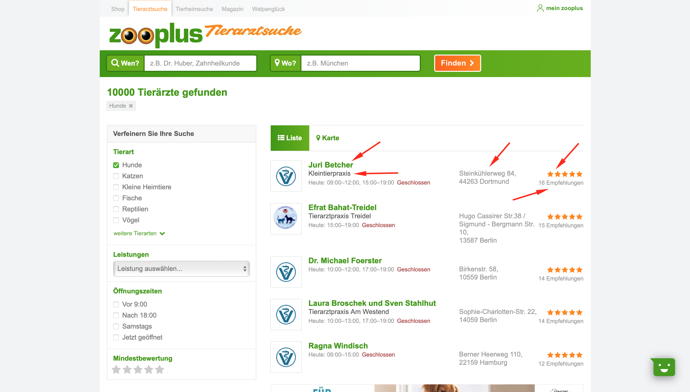

# DataForest-test-task
#### Vasyl Smutok

## Script that extracts the necessary information from the [zooplus.de](https://www.zooplus.de/tierarzt/results?animal_99=true)



## Installation

Python3 must be already installed

```shell
git clone https://github.com/Vasyl-Smutok/DataForest-test-task.git
cd parse_zooplus
python3 -m venv venv
source venv/bin/activate  # on macOS
venv\Scripts\activate  # on Windows 
pip install -r requirements.txt  
python3 parse.py # run 
```

#### Hints:
* You can change the number of pages from which you need to get information, for this, just change the value of the constant ```PAGE_TO_PARSE```
* After executing the script, you will receive a file ```data.csv``` where all the necessary information will be stored